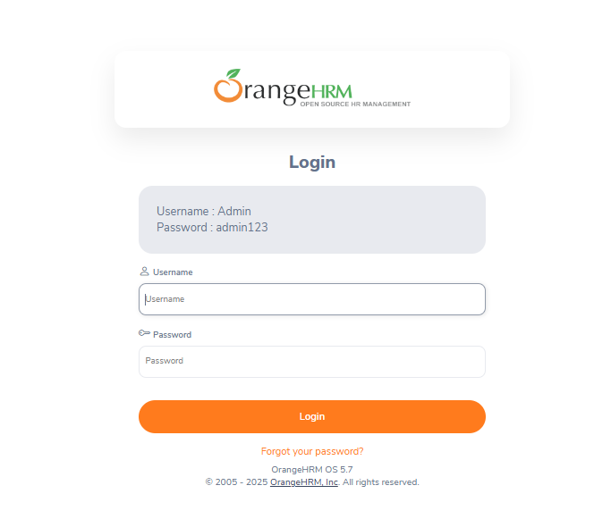
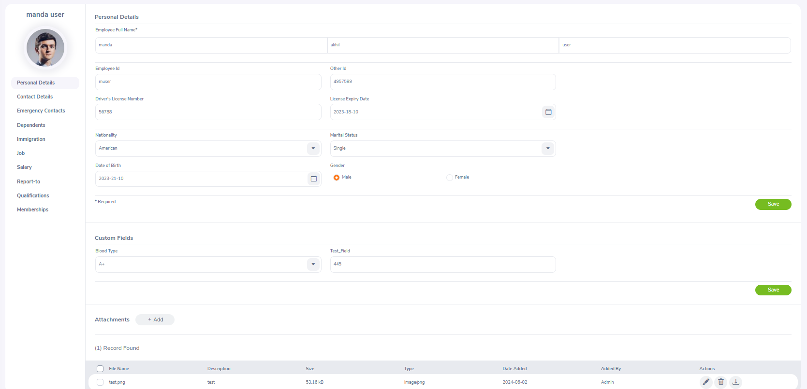
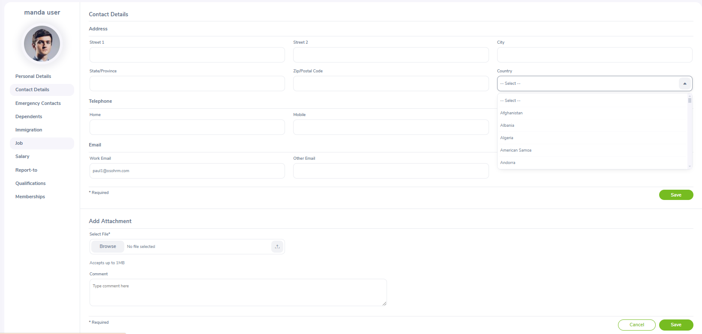

# Projeto de Estudos - Testes Automatizados com Cypress

Este repositório tem como objetivo o estudo e a prática de testes automatizados utilizando o framework Cypress no site OrangeHRM.

## Objetivo

O objetivo deste projeto é desenvolver e validar casos de testes para as seguintes funcionalidades do sistema:

- **Login**: Testar diferentes cenários de autenticação, incluindo login válido, inválido e outras possibilidades.
- **Página "My Info"**: Testar a exibição e edição das informações cadastrais dos usuários dentro da plataforma.

## Tecnologias Utilizadas

- **Cypress** - Para automação de testes end-to-end.
- **JavaScript** - Linguagem utilizada nos testes.
- **Page Objects** - Padrão de design utilizado para melhor organização e reutilização de código nos testes.
- **OrangeHRM** - Plataforma web utilizada como base para os testes.

## Como Executar os Testes

1. Clone este repositório:
   ```sh
   git clone https://github.com/AndersonPaulo/estudo-orangehrm-cypress
   ```
2. Acesse o diretório do projeto:
   ```sh
   cd seu-repositorio
   ```
3. Instale as dependências do projeto:
   ```sh
   npm install
   ```
4. Execute os testes em modo interativo:
   ```sh
   npx cypress open
   ```
5. Para executar os testes diretamente no terminal:
   ```sh
   npx cypress run
   ```

## Abaixo estão as páginas que foram testadas :

# Login 



# Personal Details



# Conact Details





## Casos de testes :